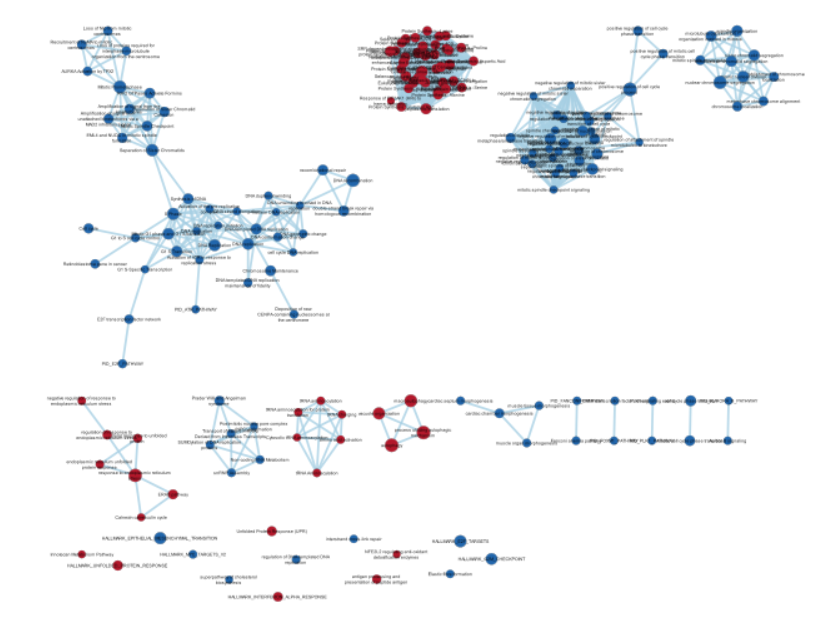
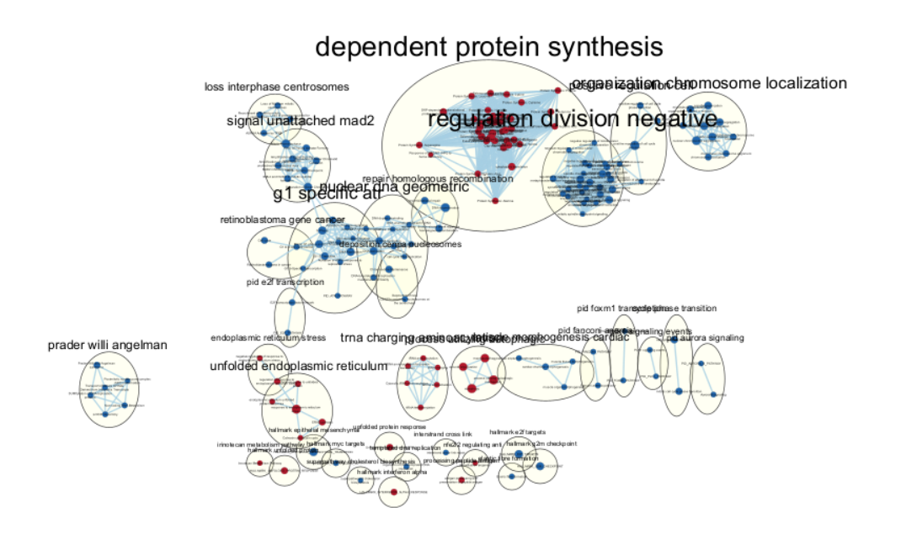
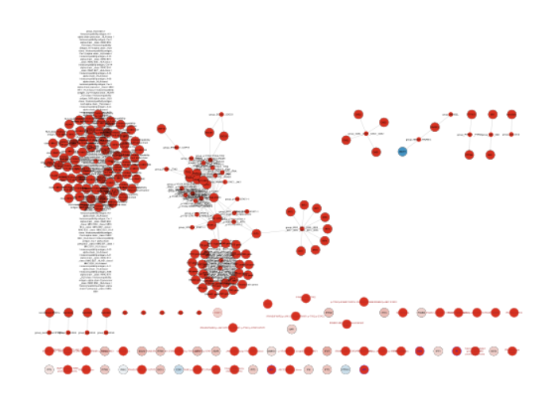

## Set Up 

```{r hide=TRUE, message = FALSE, warning = FALSE}
# Set up and Install all Libraries if not present

if (!requireNamespace("BiocManager", quietly = TRUE))
    install.packages("BiocManager")

if (!requireNamespace("GEOquery", quietly = TRUE))
    install.packages("GEOquery")

if (!requireNamespace("knitr", quietly = TRUE))
    install.packages("knitr")

if (!requireNamespace("edgeR", quietly = TRUE))
    install.packages("edgeR")

if (!requireNamespace("hrbrthemes", quietly = TRUE))
    install.packages("hrbrthemes")

if (!requireNamespace("ggplot2", quietly = TRUE))
    install.packages("ggplot2")
```

### Set Global variables and constants
```{r message = FALSE, warning = FALSE}
# Set GEOID 
GEOID <- "GSE160230"
conditions <- c("Mock", "Mock", "Mock", "Control", "Control", "Control", "GWTreated", "GWTreated", "GWTreated")

## File location
workingDir <- file.path(getwd())
```


## SUMMARY OF NORMALISATION ON RESULTS FROM A1
The study used is "hPSC-derived Airway Organoids-based Screen Reveals the Role of HIF1/ Glycolysis Axis in SARS-CoV-2 Infection" published in 2021 by Duan et al.[@duan2021airway]

The authors conducted a study in human pluripotent stem cell  (hPSC) derived airway organoids - (hPSC-AO) where they studied the molecular mechanism behind SARS-Cov-2 infections and the differential expression of different components of the pathways when treated with GW6571. This dataset was downloaded from GEOID - GSE160230. There were 9 samples and 3 conditions compared: 3 mock samples (untreated and uninfected), 3 control samples (untreated and SARS-Cov2 infected), 3 GW-treated samples (treated with GW6571 and infected with SARS-Cov2).

For this project, the original down-sampled RNA-seq data set was used for analysis. Downsampling was done on the mock and GW-treated samples by the authors Duan et al, to allow for comparability amongst the three conditions. This is because there was a significantly lower human gene count captured in the control samples due to the high viral counts.
In A1, this dataset was then pre-processed and matched using Ensembl Gene Identifiers, filtered for low expression and then normalised. The final resulting data set has 14671 genes for the 9 samples as mentioned above.

In A2, using thresholds as suggested by the paper for pathway analysis absolute logFC of 1 and significance at 5%, it was found that there were 383 up regulated genes and 905 down regulated genes in ORA.
Using GProfiler[@gprofiler], it was found that there were 1083 significant pathway hits using a significance of 5%, when considering both the upregulated and down regulated genes. The top pathway hits involved mitotic cell cycles.
If we considered only the upregulated genes, it was found that there were 320 significant pathways. The top pathway hits involved defense mechanism which are involved in immune response to viral infections - in our case SARS-Cov2. 
If we considred only the down-regulated genes, there were 1173 significant pathways using a signifcance threshold of 0.05. The down-regulated genes seem to be involved in mitotic cell processes and could potentially have overwhelmed the upregulated genes in the combined results as there are significantly more down-regulated genes than upregulated genes (905:383 respectively).


### Running A2 and importing relevant files
```{r message=FALSE, warning=FALSE}
# Render notebook 2
rmarkdown::render("../A2/A2_MichelleLin.Rmd")
```


## Non Thresholded Gene Set Enrichment

Recall that in Assignment 2, we calculated the rank for our genes. Here we will recall this ranked list.
```{r}
## Extracting the ranked data
qlfDF <- as.data.frame(ctrl_trt_top$table)
qlfDF$Gene <- rownames(qlfDF)
qlfDF$Rank <- -log(qlfDF$PValue,base =10) * sign(qlfDF$logFC)
qlfDF <- qlfDF[order(qlfDF$Rank, decreasing=TRUE),]
write.table(x=data.frame(Genee=qlfDF$Gene,
                         Rank= qlfDF$Rank),
            file=file.path(getwd(),"Control_vs_GWTreated.rnk"),
            sep = "\t",
            row.names = FALSE,
            col.names = FALSE,
            quote = FALSE)

```


For this assignment, the Human_GOBP_AllPathways_noPFOCR_no_GO_iea_March_01_2024_symbol.gmt[@BaderLab] will be used to conduct GSEA analysis[@gsea]. 
```{r}
# Set Up

## 1. Download relevant packages
#install required R and bioconductor packages
tryCatch(expr = { library("RCurl")}, 
         error = function(e) {  
           install.packages("RCurl")}, 
         finally = library("RCurl"))


## 2. Set configurable parameters
# path to GSEA jar 
gsea_jar <- "/home/rstudio/GSEA_4.3.2/gsea-cli.sh"

# directory where all the data files are found.
working_dir <- "/home/rstudio/projects/A3"

# directory where all the generated data files are found. 
output_dir <- "/home/rstudio/projects/A3/gsea/"

# the name to give the analysis in GSEA
analysis_name <- "Treated vs Untreated"

# rank file to use in GSEA analysis.  
rnk_file <- "Control_vs_GWTreated.rnk"

#run_gsea - true/false
# This parameter is for the compilation of the notebook.  
run_gsea <- TRUE

#set the gmt file you want to use if you don't want to use the latest gmt file.
# For example, if you set dest_gmt_file =="" the below script will automatically
# download the latest gmt file from baderlab website.  If it is set then it
# will use the file specified.  
dest_gmt_file <- file.path(output_dir,                         "Human_GOBP_AllPathways_noPFOCR_no_GO_iea_March_01_2024_symbol.gmt")
```


```{r}
## Download file if not present
if(dest_gmt_file == ""){
  gmt_url = "http://download.baderlab.org/EM_Genesets/current_release/Human/symbol/"
  
  #list all the files on the server
  filenames = getURL(gmt_url)
  tc = textConnection(filenames)
  contents = readLines(tc)
  close(tc)
  
  #get the gmt that has all the pathways and does not include terms 
  # inferred from electronic annotations(IEA)
  #start with gmt file that has pathways only and GO Biological Process only.
  # rx = gregexpr("(?<=<a href=\")(.*.GOBP_AllPathways_no_GO_iea.*.)(.gmt)(?=\">)",
  #   contents, perl = TRUE)
  # gmt_file = unlist(regmatches(contents, rx))
  # 
  # dest_gmt_file <- file.path(output_dir,gmt_file )
  dest_gmt_file <- "Human_GOBP_AllPathways_noPFOCR_no_GO_iea_March_01_2024_symbol.gmt"
  
  
  #check if this gmt file already exists
  if(!file.exists(dest_gmt_file)){
    download.file(
      paste(gmt_url,gmt_file,sep=""),
      destfile=dest_gmt_file
    )
  }
}
```

In order to run GSEA[@gsea], the parameters:
`nperm = 1000` was chosen, `min size of gene set = 15` and `max size of gene set = 200` as we have 14671 genes present. These numbers were chosen to ensure that only truly significant genes were found to be present. If the min size is too small, we run the risk of in accurate scoring and generation of trivial significant genes which are actually not significant. If the max size is too large, we run the risk of incorrect normalisation. 
```{r}
## Run GSEA
if(run_gsea){
  command <- paste("",gsea_jar,  
                   "GSEAPreRanked -gmx", dest_gmt_file, 
                   "-rnk" ,file.path(working_dir,rnk_file), 
                   "-collapse false -nperm 1000 -scoring_scheme weighted", 
                   "-rpt_label ",analysis_name,
                   "  -plot_top_x 20 -rnd_seed 12345  -set_max 200",  
                   " -set_min 15 -zip_report false ",
                   " -out" ,output_dir, 
                   " > gsea_output.txt",sep=" ")
  system(command)
}
```
After running the above code and examining the output, it was found that:
- the most significant pathway in the upregulated genes was HALLMARK_INTERFERON_ALPHA_RESPONSE%MSIGDBHALLMARK%HALLMARK_INTERFERON_ALPHA_RESPONSE with an enrichment score of 0.6957981 and a normalised enrichment score of 2.6389718. The nominal p-value, FDR q-value and FWER p-value was 0.0. There were 64 genes in the leading edge with gene NUB1 being the top gene.

- the most significant pathway in the deregulated genes was HALLMARK_E2F_TARGETS%MSIGDBHALLMARK%HALLMARK_E2F_TARGETS with enrichment score of -0.7298554 and normalised enrichment score of -2.9864721. The nominal p-value, FDR q-value and FWER p-value was 0.0, similar to above. There were 106 genes of 158 genes in the leading edge with CENPE being the top gene.

From a top level, it does seem that the most significant pathways are similar to those that were found in the G:Profiler analysis as well. From article [@Johnson_1998], it is known that E2F is involved in the regulation of progression from G1 to S stage via E2F transcriptions and thus, the mitotic process, similar to that discovered in the down-regulated set of genes in the analysis in GProfiler. 
Similarly, for upregulated genes, it was found that the top pathway was involved in immunoreaction involving the interferon. 

## Cytoscape [Vi]
Using Cytoscape [@shannon2003cytoscape], I generated GSEA pathways were used to generate a network map - specifically, the files: "gsea_report_for_na_neg_1713127254725.tsv" and "gsea_report_for_na_pos_1713127254725.tsv" were used as input files for the downregulated and upregulated genes respectively. A FDR q-value cutoff of 0.0001 was used to generate the graph to indicate only the gene-sets that were significantly enriched. An edge cutoff of 0.375, the default was also used creating a denser graph representation. In the graph below, the original representation style is used to generate the graph with the size of the node representing the size of the gene set, the colour of the node representing the up-regulated vs down-regulated genes as mentioned below and the label of nodes as the geneset description. Edges link genesets with overlapping genes and have a corresponding thickness relative to the overlap statistic. This graph is shown below 

```{r}

```
Image showing the networks for up-regulated and down-regulated pathway genes. The red nodes indicate up-regulated genes with the blue genes representing the down-regulated genes.  

The above map contains 176 nodes/ gene sets with 1270 edges, with an average number of 6.3 neighbours in an un-directed graph. 

Annotating the graph, we have the following network: 
```{r}

```
Image showing the pathway involvements for the clustered gene sets with major up-regulated genes, shown in red and down-regulated genes shown in blue. 


From the above diagram, we see that dependent protein synthesis is the largest network consisting of 40 nodes. This network also involve genesets that are upregulated. 

From our original GSEA results, we saw that the HALLMARK_INTERFERON_ALPHA_SIGNALLING gene set is the most significant pathway in the upregulated genes and thus, is the pathway I am interested in. Using an imported Wikipathway database [@wikipathway], I created the network for Interferon alpha/ beta signalling. This was then annotated using the ranked gene set with red showing the up-regulated genes and blue the down-regulated genes. From the following graph, we see that a majority of the genes involved in the Interferon pathway are red and hence up-regulated which is expected. 

```{r}

```
Image showing the annotated gene set network with ranked genes - red indicating more up-regulated genes and blue down-regulated genes.


## Interpretation:
The enrichment results from GSEA are similar to that in Assignment 2. Using the thresholded analysis in Assignment 2, it was found that genes were enriched in similar pathways. For down regulated genes, the genes enriched were found to be involved in mitotic processes in both test. At the opposite end, the upregulated genes seemed to be involved in immunoreaction, both with the top pathway being related to interferons. 
From the pathway visualisations and analysis using 
This however, as mentioned in Assignment 2, differed compared to the paper’s was that in this analysis as I found that up-regulated genes were involved in defense mechanisms whereas the paper found that GW-treatment did not have much of an impact on the interferon pathway - involved in defense against pathogens. I'm not certain why this may be but it is potential that due to the parameters used in our analysis, that it may differ from the results that were deemed significant in the papers.

## Bibliography